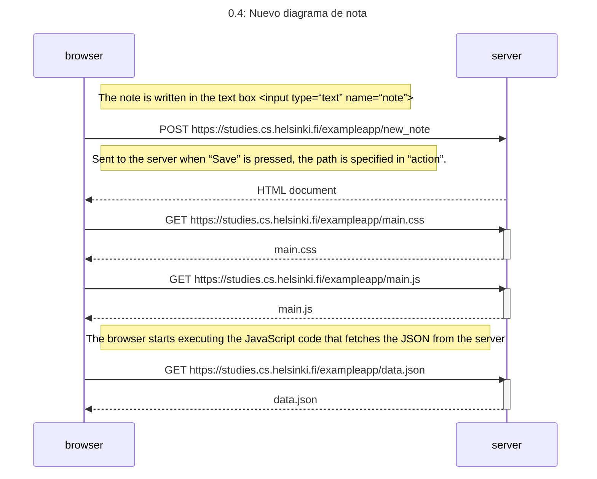

```mermaid
---
title: "0.4: Nuevo diagrama de nota"
---
sequenceDiagram
    participant browser
    participant server

    Note right of browser: The note is written in the text box <input type=“text” name=“note”>

    browser->>server: POST https://studies.cs.helsinki.fi/exampleapp/new_note
    Note right of browser: Sent to the server when “Save” is pressed, the path is specified in “action”.
    server-->>browser: HTML document

    browser->>server: GET https://studies.cs.helsinki.fi/exampleapp/main.css
    activate server
    server-->>browser: main.css
    deactivate server

    browser->>server: GET https://studies.cs.helsinki.fi/exampleapp/main.js
    activate server
    server-->>browser: main.js
    deactivate server

    Note right of browser: The browser starts executing the JavaScript code that fetches the JSON from the server

    browser->>server: GET https://studies.cs.helsinki.fi/exampleapp/data.json
    activate server
    server-->>browser: data.json
    deactivate server
```
