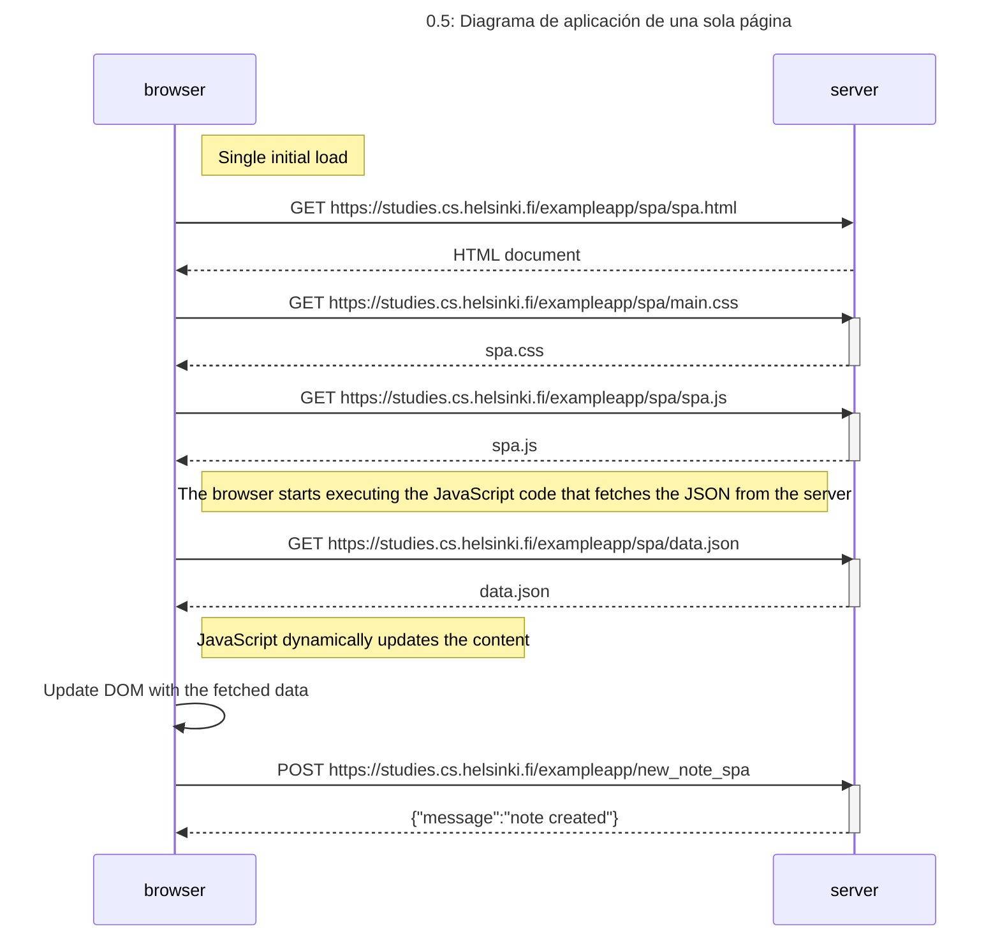

```mermaid
---
title: "0.5: Diagrama de aplicación de una sola página"
---
sequenceDiagram
    participant browser
    participant server

    Note right of browser: Single initial load
    browser->>server: GET https://studies.cs.helsinki.fi/exampleapp/spa/spa.html
    server-->>browser: HTML document

    browser->>server: GET https://studies.cs.helsinki.fi/exampleapp/spa/main.css
    activate server
    server-->>browser: spa.css
    deactivate server

    browser->>server: GET https://studies.cs.helsinki.fi/exampleapp/spa/spa.js
    activate server
    server-->>browser: spa.js
    deactivate server

    Note right of browser: The browser starts executing the JavaScript code that fetches the JSON from the server

    browser->>server: GET https://studies.cs.helsinki.fi/exampleapp/spa/data.json
    activate server
    server-->>browser: data.json
    deactivate server

    Note right of browser: JavaScript dynamically updates the content
    browser->>browser: Update DOM with the fetched data

    browser->>server: POST https://studies.cs.helsinki.fi/exampleapp/new_note_spa
    activate server
    server-->>browser: {"message":"note created"}
    deactivate server
```
